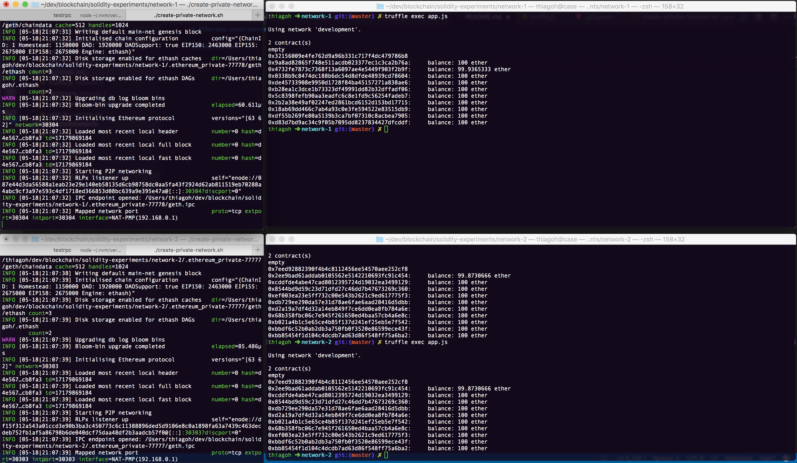

# Ethereum experiments

## How to run



```
# session 1
$ cd network-1
$ ./create-private-network.sh

# session 2
$ cd network-2
$ ./create-private-network.sh

# session 3
$ cd network-1
$ truffle migrate --reset
$ truffle exec app.js    

# session 4
$ cd network-2
$ truffle migrate --reset
$ truffle exec app.js    

```